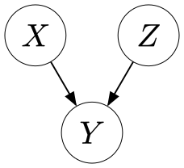
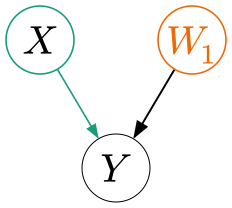
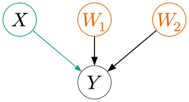
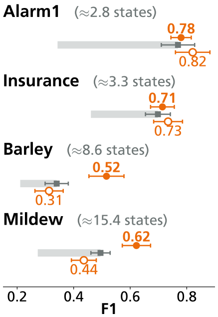
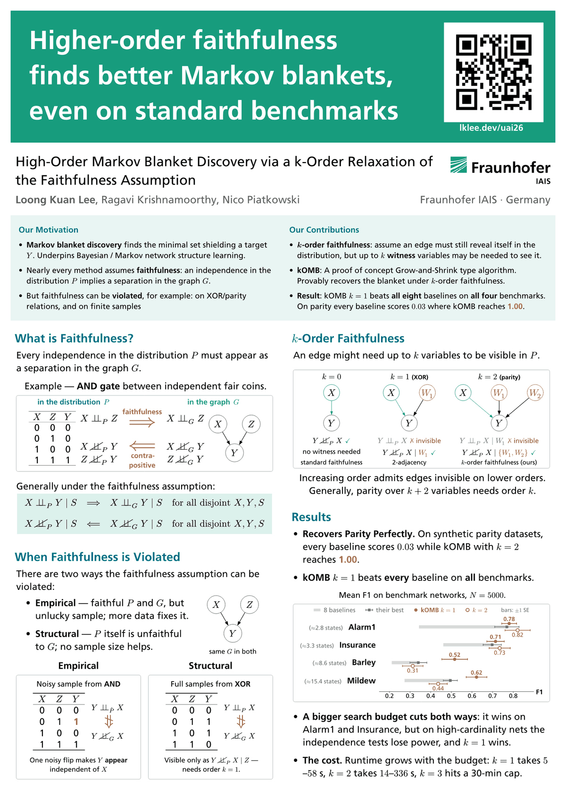

---
# jekyll-seo-tag turns this into og:image / twitter:image. It resolves against
# the baseurl set in _config.yml — without that it never absolutizes and no
# preview card is emitted. The poster image is used ONLY for the social card and
# the optional preview below; the page carries the poster's content as text and
# vector figures rather than as a picture of a poster.
image: /poster.png
---

<p class="eyebrow">UAI 2026 · Fraunhofer IAIS</p>

# High-Order Markov Blanket Discovery via a *k*-Order Relaxation of the Faithfulness Assumption

<p class="authors"><strong><a href="mailto:loong.kuan.lee@iais.fraunhofer.de">Loong Kuan Lee</a></strong>, Ragavi Krishnamoorthy, Nico Piatkowski</p>
<p class="affil">Hybrid Intelligence · Fraunhofer IAIS · Germany</p>
<p class="logo"></p>
<nav class="btns" aria-label="Paper and code"><a href="https://arxiv.org/abs/2607.26357">Paper<br>(arXiv)</a><a href="poster.pdf">Poster<br>(PDF)</a><a href="https://github.com/lklee9/k-order-Markov-blanket">Code</a><a class="ghost" href="#citing">Cite</a></nav>
<p class="plainlinks">Or as plain text: arXiv:2607.26357 (<a href="https://arxiv.org/pdf/2607.26357">direct PDF</a>) · <a href="https://github.com/lklee9/k-order-Markov-blanket/blob/main/CITATION.cff">CITATION.cff</a></p>

## Abstract
{: #abstract }

The problem of learning the graphical Markov blanket (MB) of a variable from data has applications in many areas such as structure learning for Bayesian networks and Markov random fields, causal discovery, and feature selection. However, a common assumption most methods make is that the conditional independencies in the distribution imply the same separation in the graphical structure — also known as the **faithfulness assumption**. Unfortunately, this assumption can be violated by higher-order dependencies such as XOR and parity-type relations, and — on finite samples — by empirical violations that, in extreme cases, even induce spurious dependencies absent from the true distribution. Therefore, in this paper we propose a "*k*-order" relaxation of the faithfulness assumption that captures parity-type relationships between *k*+2 variables. We then propose a proof-of-concept algorithm called ***k*-order Markov blanket (kOMB)** that uses this relaxation for MB discovery. Finally, we empirically show how kOMB can recover the MB of a variable under both true and empirical violations of faithfulness.

## Cite this work
{: #citing }

Lee, L. K., Krishnamoorthy, R., & Piatkowski, N. (2026). High-Order Markov Blanket Discovery via a *k*-Order Relaxation of the Faithfulness Assumption. In *Proceedings of the Conference on Uncertainty in Artificial Intelligence (UAI)*. To appear. arXiv:2607.26357.

<details><summary>BibTeX</summary><div markdown="1">

<div class="scroller" tabindex="0" role="region" aria-label="BibTeX entry" markdown="1">

```bibtex
@inproceedings{lee2026highorder,
  title     = {High-Order Markov Blanket Discovery via a k-Order Relaxation of the Faithfulness Assumption},
  author    = {Lee, Loong Kuan and Krishnamoorthy, Ragavi and Piatkowski, Nico},
  booktitle = {Proceedings of the Conference on Uncertainty in Artificial Intelligence (UAI)},
  year      = {2026},
  note      = {To appear},
  eprint    = {2607.26357},
  archivePrefix = {arXiv},
  primaryClass  = {cs.LG},
}
```

</div>
</div></details>

The proceedings are not published yet, so the entry is marked *to appear* and carries the arXiv id; volume and pages will be added once they exist. A machine-readable [`CITATION.cff`](https://github.com/lklee9/k-order-Markov-blanket/blob/main/CITATION.cff) is included in the repository.


<p class="claim">Higher-order faithfulness finds better Markov blankets, even on standard benchmarks.</p>
<p class="caveat">The four benchmark networks supply real network structure; the samples are drawn from those networks — hence “standard benchmarks”, not real-world data.</p>

<div class="tldr"><div><h2>Our Motivation</h2><ul><li><strong>Markov blanket discovery</strong> finds the minimal set shielding a target <i>Y</i>. Underpins Bayesian / Markov network structure learning.</li><li>Nearly every method assumes <strong>faithfulness</strong>: an independence in the distribution <i>P</i> implies a separation in the graph <i>G</i>.</li><li>But faithfulness can be <strong>violated</strong>, for example: on XOR/parity relations, and on finite samples</li></ul></div><div><h2>Our Contributions</h2><ul><li><strong><i>k</i>-order faithfulness</strong>: assume an edge must still reveal itself in the distribution, but up to <i>k</i> <strong>witness</strong> variables may be needed to see it.</li><li><strong>kOMB</strong>: A proof of concept Grow-and-Shrink type algorithm. Provably recovers the blanket under <i>k</i>-order faithfulness.</li><li><strong>Result</strong>: kOMB <i>k</i> = 1 beats <strong>all eight</strong> baselines on <strong>all four</strong> benchmarks. On parity every baseline scores 0.03 where kOMB (<i>k</i> = 2) reaches <span class="wit">1.00</span>.</li></ul></div></div>


<ul class="jump"><li><a href="#faithfulness">Faithfulness</a></li><li><a href="#breaks">How it breaks</a></li><li><a href="#korder"><i>k</i>-order</a></li><li><a href="#results">Results</a></li><li><a href="#citing">Cite</a></li></ul>

## What is Faithfulness?
{: #faithfulness }

Every independence in the distribution <i>P</i> must appear as a separation in the graph <i>G</i>.

<div class="panel"><p class="cap">Example — <strong>AND gate</strong> between independent fair coins.</p><div class="duo"><table class="truth"><caption>The AND gate: <i>Y</i> = 1 only when <i>X</i> = <i>Z</i> = 1.</caption><thead><tr><th scope="col"><i>X</i></th><th scope="col"><i>Z</i></th><th scope="col"><i>Y</i></th></tr></thead><tbody><tr><td>0</td><td>0</td><td>0</td></tr><tr><td>0</td><td>1</td><td>0</td></tr><tr><td>1</td><td>0</td><td>0</td></tr><tr><td>1</td><td>1</td><td>1</td></tr></tbody></table></div><div class="reading"><div class="side side-p"><h3>in the distribution <i>P</i></h3><p class="rel"><i>X</i> <span class="ci" role="img" aria-label="is independent of">⊥⊥</span><sub><i>P</i></sub> <i>Z</i></p></div><p class="connector"><span class="lbl">faithfulness</span><span class="arrow" aria-hidden="true">⇓</span><span class="vh">implies</span></p><div class="side side-g"><h3>in the graph <i>G</i></h3><p class="rel"><i>X</i> <span class="ci" role="img" aria-label="is separated from">⊥⊥</span><sub><i>G</i></sub> <i>Z</i></p></div></div><p class="readnote">Read forwards, on the <strong>non-adjacent</strong> pair <i>X</i>, <i>Z</i>.</p><hr class="readsplit"><div class="reading"><div class="side side-g"><h3>in the graph <i>G</i></h3><p class="rel"><i>X</i> <span class="nci" role="img" aria-label="is not separated from">⊥⊥</span><sub><i>G</i></sub> <i>Y</i></p><p class="rel"><i>Z</i> <span class="nci" role="img" aria-label="is not separated from">⊥⊥</span><sub><i>G</i></sub> <i>Y</i></p></div><p class="connector"><span class="lbl">contrapositive</span><span class="arrow" aria-hidden="true">⇓</span><span class="vh">implies</span></p><div class="side side-p"><h3>in the distribution <i>P</i></h3><p class="rel"><i>X</i> <span class="nci" role="img" aria-label="is not independent of">⊥⊥</span><sub><i>P</i></sub> <i>Y</i></p><p class="rel"><i>Z</i> <span class="nci" role="img" aria-label="is not independent of">⊥⊥</span><sub><i>P</i></sub> <i>Y</i></p></div></div><p class="readnote">Read backwards, on the <strong>adjacent</strong> pairs <i>X</i>, <i>Y</i> and <i>Z</i>, <i>Y</i> — the direction Markov blanket discovery relies on, and the one XOR breaks.</p></div>

Generally under the faithfulness assumption:

<div class="eqbox"><p><i>X</i> <span class="ci" role="img" aria-label="is independent of">⊥⊥</span><sub><i>P</i></sub> <i>Y</i> | <i>S</i> &nbsp;<span aria-hidden="true">⟹</span><span class="vh">implies</span>&nbsp; <i>X</i> <span class="ci" role="img" aria-label="is separated from">⊥⊥</span><sub><i>G</i></sub> <i>Y</i> | <i>S</i></p><p><i>X</i> <span class="nci" role="img" aria-label="is not independent of">⊥⊥</span><sub><i>P</i></sub> <i>Y</i> | <i>S</i> &nbsp;<span aria-hidden="true">⟸</span><span class="vh">is implied by</span>&nbsp; <i>X</i> <span class="nci" role="img" aria-label="is not separated from">⊥⊥</span><sub><i>G</i></sub> <i>Y</i> | <i>S</i></p><p class="scope">for all disjoint <i>X</i>, <i>Y</i>, <i>S</i></p></div>

In the example above <i>X</i>, <i>Z</i> and <i>Y</i> are single variables; in this general form <i>X</i>, <i>Y</i> and <i>S</i> are disjoint *sets*.

## When Faithfulness is Violated
{: #breaks }

There are two ways the faithfulness assumption can be violated:

- **Empirical** — faithful <i>P</i> and <i>G</i>, but unlucky sample; more data fixes it.
- **Structural** — <i>P</i> itself is unfaithful to <i>G</i>; no sample size helps.

<figure><p class="figcap">The same <i>G</i> in both cases below — only the distribution changes.</p></figure>

<div class="ladder ladder--duo"><div class="panel"><p class="cap"><strong>Empirical</strong></p><h3>Noisy sample from <strong>AND</strong></h3><div class="duo"><table class="truth"><caption>Row 2 carries one noise flip: <i>Y</i> = 1 where the AND gate gives 0.</caption><thead><tr><th><i>X</i></th><th><i>Z</i></th><th><i>Y</i></th></tr></thead><tbody><tr><td>0</td><td>0</td><td>0</td></tr><tr><td>0</td><td>1</td><td class="flip">1<span class="vh"> (flipped)</span></td></tr><tr><td>1</td><td>0</td><td>0</td></tr><tr><td>1</td><td>1</td><td>1</td></tr></tbody></table><div class="implic"><p class="rel"><i>Y</i> <span class="ci" role="img" aria-label="is independent of">⊥⊥</span><sub><i>P̂</i></sub> <i>X</i></p><p class="breaks-arrow"><span class="arrow" aria-hidden="true">⇓</span><span class="lbl">does not imply</span></p><p class="rel"><i>Y</i> <span class="nci" role="img" aria-label="is not separated from">⊥⊥</span><sub><i>G</i></sub> <i>X</i></p></div></div><p class="figcap">One noisy flip makes <i>Y</i> <strong>appear</strong> independent of <i>X</i>.</p></div><div class="panel"><p class="cap"><strong>Structural</strong></p><h3>Full samples from <strong>XOR</strong></h3><div class="duo"><table class="truth"><caption>The complete XOR relation — no noise, every row exact.</caption><thead><tr><th><i>X</i></th><th><i>Z</i></th><th><i>Y</i></th></tr></thead><tbody><tr><td>0</td><td>0</td><td>0</td></tr><tr><td>0</td><td>1</td><td>1</td></tr><tr><td>1</td><td>0</td><td>1</td></tr><tr><td>1</td><td>1</td><td>0</td></tr></tbody></table><div class="implic"><p class="rel"><i>Y</i> <span class="ci" role="img" aria-label="is independent of">⊥⊥</span><sub><i>P</i></sub> <i>X</i></p><p class="breaks-arrow"><span class="arrow" aria-hidden="true">⇓</span><span class="lbl">does not imply</span></p><p class="rel"><i>Y</i> <span class="nci" role="img" aria-label="is not separated from">⊥⊥</span><sub><i>G</i></sub> <i>X</i></p></div></div><p class="figcap">Visible only as <i>Y</i> <span class="nci" role="img" aria-label="is not independent of">⊥⊥</span><sub><i>P</i></sub> <i>X</i> | <i>Z</i> — needs order <i>k</i> = 1.</p></div></div>

## *k*-Order Faithfulness
{: #korder }

An edge might need up to <i>k</i> variables to be visible in <i>P</i>.

<div class="ladder ladder--trio"><div class="panel"><p class="cap"><strong><i>k</i> = 0</strong></p><p class="rel">Tested alone: <i>Y</i> <span class="nci" role="img" aria-label="is not independent of">⊥⊥</span><sub><i>P</i></sub> <i>X</i> <span class="verdict-ok">✓ visible</span></p><p class="figcap">No witness needed. Covered by standard faithfulness.</p></div><div class="panel"><p class="cap"><strong><i>k</i> = 1</strong> (XOR)</p><p class="rel dim">Tested alone: <i>Y</i> <span class="ci" role="img" aria-label="is independent of">⊥⊥</span><sub><i>P</i></sub> <i>X</i> <span class="verdict-no">✗ invisible</span></p><p class="rel">With one witness: <i>Y</i> <span class="nci" role="img" aria-label="is not independent of">⊥⊥</span><sub><i>P</i></sub> <i>X</i> | <span class="wit"><i>W</i><sub>1</sub></span> <span class="verdict-ok">✓ visible</span></p><p class="figcap">Covered by 2-adjacency faithfulness (<a href="https://proceedings.mlr.press/v161/marx21a.html">Marx et al., 2021</a>).</p></div><div class="panel"><p class="cap"><strong><i>k</i> = 2</strong> (parity)</p><p class="rel dim">Given one witness: <i>Y</i> <span class="ci" role="img" aria-label="is independent of">⊥⊥</span><sub><i>P</i></sub> <i>X</i> | <i>W</i><sub>1</sub> <span class="verdict-no">✗ still invisible</span></p><p class="rel">With two witnesses: <i>Y</i> <span class="nci" role="img" aria-label="is not independent of">⊥⊥</span><sub><i>P</i></sub> <i>X</i> | <span class="wit">{<i>W</i><sub>1</sub>, <i>W</i><sub>2</sub>}</span> <span class="verdict-ok">✓ visible</span></p><p class="figcap">Covered by <i>k</i>-order faithfulness — this work.</p></div></div>

Increasing order admits edges invisible on lower orders. Generally, parity over <i>k</i> + 2 variables needs order <i>k</i>. (<i>W</i> here is the paper's <i>Z</i>, renamed so it does not collide with the <i>Z</i> in the AND and XOR examples above.)

## kOMB, the algorithm
{: #komb }

**kOMB** is a proof-of-concept modification of Grow-and-Shrink that grows the candidate blanket by whole *witness sets*. It provably recovers the graphical Markov blanket under *k*-order faithfulness, the Global Markov Property, and an *l*-bounded separator assumption. The conditional-independence tests and the kOMB search are implemented in Rust; the eight baselines come from [pyCausalFS](https://github.com/wt-hu/pyCausalFS). Pseudocode, the full assumption set and the proofs are in the paper.

## Results
{: #results }

- **Recovers parity perfectly.** On synthetic parity datasets, every baseline scores 0.03 while kOMB with *k* = 2 reaches <span class="wit">1.00</span> — exactly, in every run.
- **kOMB *k* = 1 beats every baseline on all benchmarks.**

<div class="scroller" tabindex="0" role="region" aria-label="Benchmark F1 results"><table><caption>Mean F1 over 10 largest-neighbourhood targets × 10 independent samples of <i>N</i> = 5000. Bold = highest in row. Networks ordered by mean states per variable.</caption><thead><tr><th scope="col">Network</th><th scope="col" class="num">Best of&nbsp;8</th><th scope="col" class="num">kOMB&nbsp;<i>k</i>&thinsp;=&thinsp;1</th><th scope="col" class="num">kOMB&nbsp;<i>k</i>&thinsp;=&thinsp;2</th></tr></thead><tbody><tr><th scope="row">Alarm1 <span class="dim">(≈2.8)</span></th><td class="num">0.769</td><td class="num">0.780</td><td class="num"><strong>0.821</strong></td></tr><tr><th scope="row">Insurance <span class="dim">(≈3.3)</span></th><td class="num">0.698</td><td class="num">0.714</td><td class="num"><strong>0.734</strong></td></tr><tr><th scope="row">Barley <span class="dim">(≈8.6)</span></th><td class="num">0.340</td><td class="num"><strong>0.516</strong></td><td class="num">0.313</td></tr><tr><th scope="row">Mildew <span class="dim">(≈15.4)</span></th><td class="num">0.495</td><td class="num"><strong>0.622</strong></td><td class="num">0.436</td></tr></tbody></table></div>

<details><summary>Baseline range and ±1 SE</summary><div class="scroller" tabindex="0" role="region" aria-label="Baseline range and standard errors"><table><caption>Range across all eight baselines, and ±1 standard error. std is over the 100 runs (10 targets × 10 samples); SE divides it by √10, treating the 10 targets as the independent units.</caption><thead><tr><th scope="col">Network</th><th scope="col" class="num">8 baselines</th><th scope="col" class="num">Best</th><th scope="col" class="num"><i>k</i>=1</th><th scope="col" class="num"><i>k</i>=2</th></tr></thead><tbody><tr><th scope="row">Alarm1</th><td class="num">0.343–0.769</td><td class="num">0.769±0.059</td><td class="num">0.780±0.036</td><td class="num">0.821±0.061</td></tr><tr><th scope="row">Insurance</th><td class="num">0.461–0.698</td><td class="num">0.698±0.044</td><td class="num">0.714±0.042</td><td class="num">0.734±0.051</td></tr><tr><th scope="row">Barley</th><td class="num">0.211–0.340</td><td class="num">0.340±0.041</td><td class="num">0.516±0.062</td><td class="num">0.313±0.050</td></tr><tr><th scope="row">Mildew</th><td class="num">0.273–0.495</td><td class="num">0.495±0.034</td><td class="num">0.622±0.050</td><td class="num">0.436±0.044</td></tr></tbody></table></div></details>

<figure><p class="figcap">Mean F1 on benchmark networks, <i>N</i> = 5000.</p><p class="legend">Grey band = range of the 8 baselines · grey square = their best · filled orange circle = kOMB <i>k</i> = 1 · hollow orange circle = <i>k</i> = 2 · bars = ±1 SE.<br>Every value in the chart also appears in the table above, rounded to 2 dp — if you edit one, edit both.</p></figure>

- **A bigger search budget cuts both ways**: it wins on Alarm1 and Insurance, but on high-cardinality nets the independence tests lose power, and *k* = 1 wins. The Barley (+0.18) and Mildew (+0.13) gains over the best baseline both exceed 2 SE; on Alarm1 and Insurance the margin is within noise.
- **The cost.** Runtime grows with the budget: *k* = 1 takes 5–58 s, *k* = 2 takes 14–336 s, *k* = 3 hits a 30-min cap. *k* = *l* ≤ 2 is a robust default, and approximate variants that keep the guarantee while taming the *k* = 2 cost are the open problem.

## The poster
{: #poster }

**[Download the poster — PDF, 175 KB, A0 portrait](poster.pdf)**

Everything above is on it: what faithfulness is, the two ways it breaks, what the *k*-order relaxation buys, and the benchmark results. The diagrams and the chart on this page are exported from the same Typst source as the printed poster.

<details><summary>Preview the poster image (278 KB)</summary><a href="poster.pdf"></a></details>

## Install and reproduce
{: #reproduce }

<details><summary>Clone, build and reproduce the results</summary><div markdown="1">

<div class="scroller" tabindex="0" role="region" aria-label="Install commands" markdown="1">

```bash
git clone https://github.com/lklee9/k-order-Markov-blanket
cd k-order-Markov-blanket
git submodule update --init --recursive
python -m venv .venv && source .venv/bin/activate
pip install -r requirements.txt
```

</div>

Datasets are not committed — `experiments/get_data.py` fetches the benchmark networks and generates the synthetic ones. The [README](https://github.com/lklee9/k-order-Markov-blanket#readme) documents the full pipeline, including how to regenerate every table and figure in the paper from scratch.

</div></details>

<p class="funding">Funded by the Federal Ministry of Research, Technology and Space of Germany and the state of North Rhine-Westphalia as part of the Lamarr Institute for Machine Learning and Artificial Intelligence.</p>
